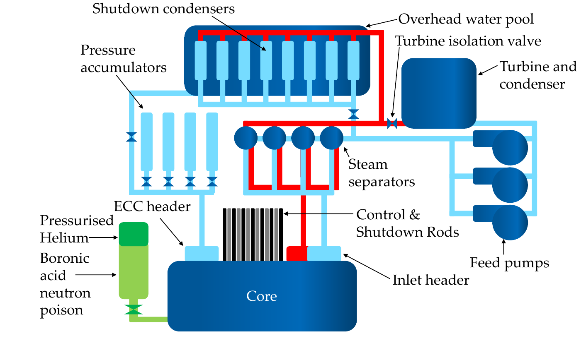
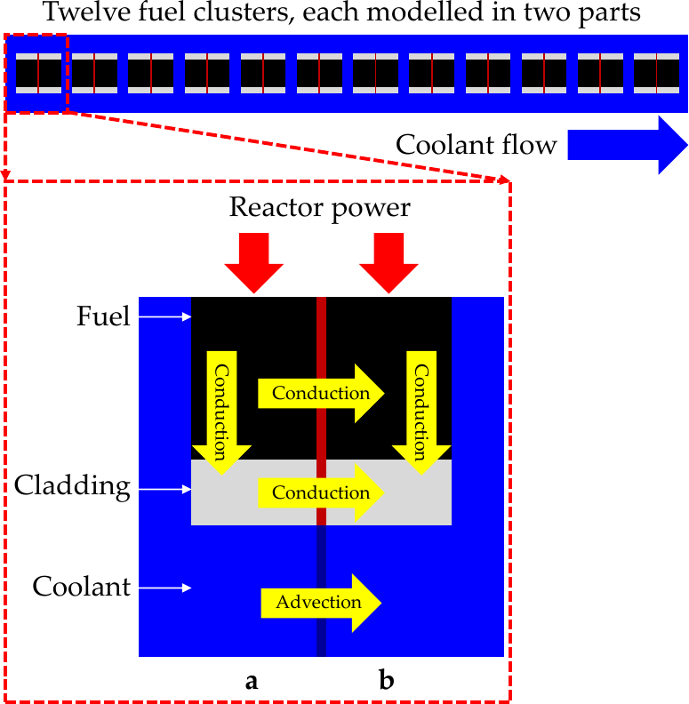
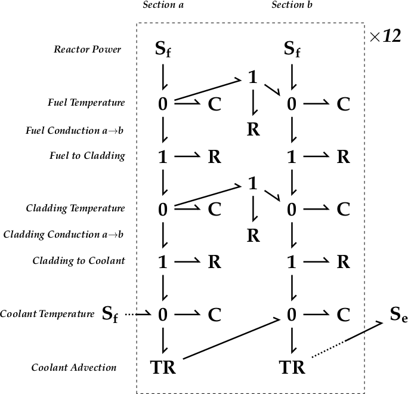

# FMU Interface for Macchiato

*For the hybridisation of Petri Nets with physical models in FMU format.*

## Dependencies

* [Python 3](https://www.python.org)
* [Macchiato](https://github.com/MJWootton-Research/Macchiato)
* [PyFMI](https://github.com/modelon-community/PyFMI) from [JModelica](https://jmodelica.org/) which itself has the dependencies:
  * [FMI Library](http://www.jmodelica.org/FMILibrary)
  * [NumPy](http://pypi.python.org/pypi/numpy)
  * [SciPy](http://pypi.python.org/pypi/scipy)
  * [lxml](http://pypi.python.org/pypi/lxml)
  * [Assimulo](http://pypi.python.org/pypi/Assimulo)
  * [Cython](http://cython.org/)
  * Python-headers (may be pre-installed, depending on the system)

Where possible, install the PyFMI dependencies through [Conda](https://docs.conda.io/en/latest/) as at the time of writing (March 2021), it seems that the version of the libraries available from [pip](https://pip.pypa.io/en/stable/) are outdated. Outdated libraries installed via pip should be uninstalled to prevent conflicts with the more up-to-date libraries from Conda. Once PyFMI is installed, the versions available to is can be found by running the following commands in a interactive Python session or script:

```python
>>> import pyfmi
>>> pyfmi.check_packages()
```

Output akin to the below should be expected:

```
Performing pyfmi package check
==============================

PyFMI version ................ 2.8.5                         

Platform ..................... {your OS}                         

Python version ............... 3.8.5                         


Dependencies:

Package                        Version                       
-------                        -------                       
assimulo...................... 3.2.3                         
Cython........................ 0.29.22                       
lxml.......................... 4.6.2                         
matplotlib.................... 3.3.4                         
numpy......................... 1.20.1                        
scipy......................... 1.6.1
```

## Introduction

Hybrid [Petri Net](https://en.wikipedia.org/wiki/Petri_net)-Physical models are achieved through a number of steps. The Petri Net (PN) is handled solely through Macchiato itself, but the physical part of the model is loaded and run as an FMU ([functional mock-up unit](https://www.modelon.com/fmi-functional-mock-up-unit-types)) via [PyFMI](https://github.com/modelon-community/PyFMI). The FMUs in this work were exported from Modelica but in principle any suitably configured FMU is usable. The [Bond Graph](https://en.wikipedia.org/wiki/Bond_graph) (BG) methodology was used to describe the physical processes, achieved within Modelica via the [BondLib library](https://build.openmodelica.org/Documentation/BondLib.html). The coordination between the two parts of the model is managed by the file [`FMUInterface.py`](https://github.com/MJWootton-Research/Macchiato/blob/master/FMUInterface.py). This file should not be edited by the user; instead, follow the guide found in the [Usage](#usage) section which explains how to set up the PN-FMU interface.

## Usage

### Interface Specification

Unlike the process for constructing purely PN models with Macchiato, a small amount of coding is required to specific the desired relationship between the PN and a BG components. The file `FMUInterface.py` imports the essential modules and provides the `pnfmu` object class used to execute the hybrid model. This class must be extended to fully specify the relationship. This should be done in an entirely separate script using a feature of Python known as [inheritance](https://www.w3schools.com/python/python_inheritance.asp). In the inheriting class definition, all properties of the system that user wishes to be able to alter must be added as attributes in `__init__`. The method `inputFunction` must be updated to return all of the inputs expected by the FMU in the order in which they were specified and in the appropriate units (i.e. [SI](https://en.wikipedia.org/wiki/International_System_of_Units)). Conversely, the rules for changes made to the PN in response to the physical state of the BG  (or other FMU model) should be specified in `netUpdate`. This method must return a Boolean value `update`, which should be `True` if any changes have been made and `False` otherwise. The methods, `newPN`, `endFiles`, `setPN`, `processResults`, and `run` are generic to any system and should not be altered. Remember: <u>Do not</u> alter the file `FMUInterface.py` itself.

Having created the bespoke interface required for the hybrid model, it is recommend that the user create a function to the script to manage executions of the model and handle any command line arguments. It is likely that one should wish to run many iterations of the system to collect statistics. Make sure that the method `processResults` is always called directly after each call to `run`, otherwise the results from that iteration will not recorded to file.

Care take to ensure that consistent units of time, preferably seconds, are used between the components of the model.

### General Parameters

The basic `pnfmu` object class takes the following parameters:

* Required:
  * `name` — A label for the model
  * `pn` — Petri Net to use in the hybrid model as either PetriNet object from Macchiato or path to an `*.mpn` file
  * `fmuPath` — Path to FMU to use in the hybrid model
  * `inputs` — A list object containing the input variable names as strings in the order expected by the FMU source code
* Optional:
  * `wd` — Alternative working directory for the hybrid simulation (Default is `None`, resulting in no change)
  * `tMax` — The maximum simulation clock in seconds
  * `tStep` — The sampling period for checking the physical model for states requiring updates to the Petri Net. For example, the temperature of a component reaching the critical value at which a reactive process is activated.

Additional parameters can be added to the inherited class in accordance with the requirements of the simulation.

### Constructing a Model

For instruction relating to the creation of the PN component of the hybrid model, please refer to the documentation for [Macchiato](https://github.com/MJWootton-Research/Macchiato). When constructing a PN, consider how it is going to interact with the physical model and make sure that its places present the necessary information simply. The FMU can constructed by any means convenient to the user, but must to be able to accept the input of external variables. In Modelica, this is achieved by declaring variables of type `input Real ` at the beginning of the model and using them as the parameterisation of input blocks etc. – for instance, in the case of the work presented here, variable components from the BondLib library have been used. Modelica environments such as [OpenModelica](https://www.openmodelica.org/) (OMEdit/OMShell) or [Dymola](https://www.3ds.com/products-services/catia/products/dymola/) can be used for the development of suitable models and to export them to in FMU form.

### Example

An example system is presented, taken from {*pending*}. A PN describing the failure modes of a nuclear reactor is coupled with a representation of heat flow through its fuel rods in BG form. A schematic of the system is shown in figure 1 and the corresponding PN is shown in figure 2.

|                    |                          |
| :----------------------------------------------------------- | :----------------------------------------------------------- |
| Figure 1: *Schematic of reactor primary coolant, shutdown condensation, and emergency shutdown system.* | Figure 2: *PN structure representing the failure modes and maintenance of the reactor system. Subsystems are highlighted by colour:<br />blue – primary coolant<br />green – shutdown condensation<br />yellow – emergency coolant injections<br />red – reactor shutdown systems<br />black – terminal states.* |

For the sake of the model, each fuel rod is treated as identical, so only one need be simulated. The rod is comprised of twelve clusters of uranium dioxide fuel pins in series, coated in zircaloy-2 cladding, and surrounded by light water coolant flowing down its length as a steam/liquid mix. Each cluster of pins is modelled in two parts, with heat transfer along its length, between each material, and in accordance with the mass flow of coolant. Figure 3 shows a schematic of the rod and figure 4 shows the BG model.

|                   |                          |
| ----------------------------------------------------- | :----------------------------------------------------------- |
| Figure 3: *Diagram of heat transfer along a fuel rod* | Figure 4: *BG modelling heat transfer in a fuel rod. There are twelve repeating sections in series* |

The files for this model are available in the folder [`PNFMU_Hybrid_Example`](https://github.com/MJWootton-Research/Macchiato/tree/master/FMUInterface/Example) and its subdirectories. In `ATR_Model`, the files required to run the example are found, with `ATR_PetriNet.mpn` and `ATR_Bond_Graph_{X}.fmu` being the inputs for the PN and BG parts of the model respectively, where `{X}` is the operating system in use (a 64 bit version of Linux, macOS, or Windows 10 is required). These are read by  `ATR_Hybrid.py` to achieve the hybridisation, discussed in detail [below](#atr_hybridpy).

The folder `Petri_Net_Construction` contains `ATR_PetrNet_Base.vsdm` with provides convenient graphical editing of the former via MS Visio ([see here](https://github.com/MJWootton-Research/Macchiato/blob/master/PetriNetDrawingTools/README.md) for details of the usage of the macro). Note that as the reactor has forty shutdown rods, the function and failure of each of which is modelled individually, this part of the PN is not generated from `ATR_PetrNet_Base.vsdm`, but instead via the script `Rods.py`.  The script will write an `*.mpn` file with the desired number of rods which can be copied into the output of `ATR_PetrNet_Base.vsdm`.

The folder `Reactor_Bond_Graph` contains the Modelica package required to build the FMU, which can be viewed and edited from the aforementioned Modelica environments. A version of the model for FMU export is found as `ATR_BondGraph_FMU.mo`, as well as a stand-alone version as `ATR_Bond_Graph.mo`. When loading the Modelica codes, import BondLib first ([available here](https://github.com/modelica-3rdparty/BondLib) or [here](https://github.com/MJWootton-Research/BondLib)), followed by `Reactor_Bond_Graph`. In both cases, this is done by loading the file named `package.mo` in their respectively top directories.

####  `ATR_Hybrid.py`

This file sets up the specific interactions for the example system and manages the execution of batches of simulation. Its structure is explained in the following sections It is assumed that the reader is already familiar with the concept of inheritance in Python and has read the documentation in [`FMUInterface.py`](https://github.com/MJWootton-Research/Macchiato/blob/master/FMUInterface.py) itself.

##### `atr`

The first step is to create an object class which inherits from the `pnfmu` class of [`FMUInterface`](https://github.com/MJWootton-Research/Macchiato/blob/master/FMUInterface.py) (referenced locally as `fmui`).

```python
class atr(fmui.pnfmu):
    def __init__(self, name, pn, fmuPath, inputs, wd=None, tMax=3600.0, tStep=10.0):
        fmui.pnfmu.__init__(self, name, pn, fmuPath, inputs, wd, tMax, tStep)
```

To this new class the attributes required to describe the features of the system salient to the interface are added; in this case, the default parameters values to passed to the FMU and a number of Boolean tags to record some important system state toggles.

##### `inputFunction` & `netUpdate`

Next, an updated version of `inputFunction` must be supplied. This must read the state of the PN and the value of the simulation clock (supplied as a parameter, `t`, which must be given, even if irrelevant), and  returns the values expected by the FMU. Likewise, the user must supply their version of `netUpdate` to read the last recorded state of the FMU and makes any necessary adjustment to the marking of the PN, returning a Boolean value to indicate if changes have been made. The state of the FMU is accessible from the attribute `self.results`, and to get the most recent value of variable one uses `self.results[-1]['NAME'][-1]`, where `'NAME'` is the label assigned to the variable in Modelica (or equivalent). In this example, the temperature of the fuel and cladding components are checked against their thresholds for damage and marks the places `PFuelOverheat` or `PCladOverheat` accordingly.

##### `run`

Separate from the `atr` object, the `run` function manages initial set of the hybrid model object and repeated executions of the simulation. If `ATR_Hybrid.py` is run from the command line directly, arguments passed to `run` from `main()`, but the file can also be imported as a module in a separate script, with the user passing the required parameters from there. The parameters need to be supplied as a `list` object in the following order:

1. Path to the `*.mpn` file containing the PN, or a `PetriNet` object as defined in Macchiato's [`PetriNet.py`](https://github.com/MJWootton-Research/Macchiato/blob/master/PetriNet.py)
2. Path to the `*.fmu` file containing the physical model
3. Simulations to perform, which can take the form of a single integer, in which case, that many simulations will be performed, or two integers in ascending order separated by a colon, in which case, simulations with labels from the lower to upper bound will be executed. This allows a batch of simulations to be run in parts at the convenience of the user.
4. (Optional) Path in which a new folder is created to save simulation output. By default, the current working directory is used.

To facilitate the interaction between the PN and FMU, a number of transitions and places are added to the base PN ([see here](https://github.com/MJWootton-Research/Macchiato#scripting-tools) for more details of Macchiato's PN scripting tools).

```python
    pn.trans['TUnsafe'].maxFire = None
    pn.addTrans('TUnsafeCounter', delay=25.0, maxFire=1)
    pn.trans['TUnsafeCounter'].addInArc('PUnsafe')
    pn.trans['TUnsafeCounter'].addOutArc('PUnsafe')
    pn.addPlace('PFuelOverheat')
    pn.addPlace('PCladOverheat')
    pn.addTrans('TFuelOverheat', maxFire=1)
    pn.addTrans('TCladOverheat', maxFire=1)
    pn.trans['TFuelOverheat'].addInArc('PFuelOverheat')
    pn.trans['TFuelOverheat'].addOutArc('PFuelOverheat')
    pn.trans['TCladOverheat'].addInArc('PCladOverheat')
    pn.trans['TCladOverheat'].addOutArc('PCladOverheat')
```

As the PN's parameters are given in hours, and those of the FMU are in seconds, the former must be converted.

```python
    for t in pn.trans:
        if pn.trans[t].uniform is not None:
            pn.trans[t].uniform *= 3600.0
        if pn.trans[t].delay is not None:
            pn.trans[t].delay *= 3600.0
        if pn.trans[t].weibull is not None:
            pn.trans[t].weibull[0] *= 3600.0
            if len(pn.trans[t].weibull) == 3:
                pn.trans[t].weibull[2] *= 3600.0
        if pn.trans[t].cyclic is not None:
            pn.trans[t].cyclic[0] *= 3600.0
            pn.trans[t].cyclic[1] *= 3600.0
    pn.units = 'sec'
```

A `list` object, `inputs`, must be supplied which contains the input variable names anticipated by the FMU, matching the order in which they are returned by `inputFunction`.

```python
    inputs = [
              'fuelThIn',
              'coolTR',
              'coolTin',
              'fuelC',
              'fuelToCladR',
              'cladC',
              'cladToCoolR',
              'coolC',
              'fuelToFuelR',
              'cladToCladR',
              'spCap'
             ]
```

Next a `list` of the names of variables from the FMU that the user wishes to monitor must be given as a `list` called `interest`.  Any variable that is required to be visible to `netUpdate` must be included. Only variables given in `interest` will be recorded in the simulation output files. In this example, the variables of interest are the thermal energy entering the system from the fuel (`fuelThIn`), the coolant mass flow rate (`coolTR`), the coolant temperature on entry to the rod `coolTin` and the temperatures of each of the 24 points along the rod at which the coolant, cladding, and fuel, are modelled (`Coolant1.e`, `Cladding1.e`, `Fuel1.e`, etc.).

```python
    interest = ['fuelThIn', 'coolTR', 'coolTin']
    for i in ['Coolant', 'Cladding', 'Fuel']:
        for j in range(1,25):
            interest.append('%s%d.e' % (i,j))
```

The function then loops for the required number of simulations, at each iteration creating a fresh copy of the hybrid model object and running it.

```python
        model = atr(pn.name,
                    pn,
                    fmu,
                    inputs,
                    wd=wd,
                    tMax=4.0*365.25*24*3600.0,
                    tStep=8766.0*3600.0)
        model.run()
        model.processResults(interest)
```

#### Execution

To run the the above example with a simulation batch size of 1000, one would enter the following:

```bash
$ python Example/ATR_Model/ATR_Hybrid.py Example/ATR_Model/ATR_PetriNet.mpn Example/ATR_Model/ATR_BondGraph_{OS}.fmu 1000
```

where `{OS}` is replaced by the appropriate system.
