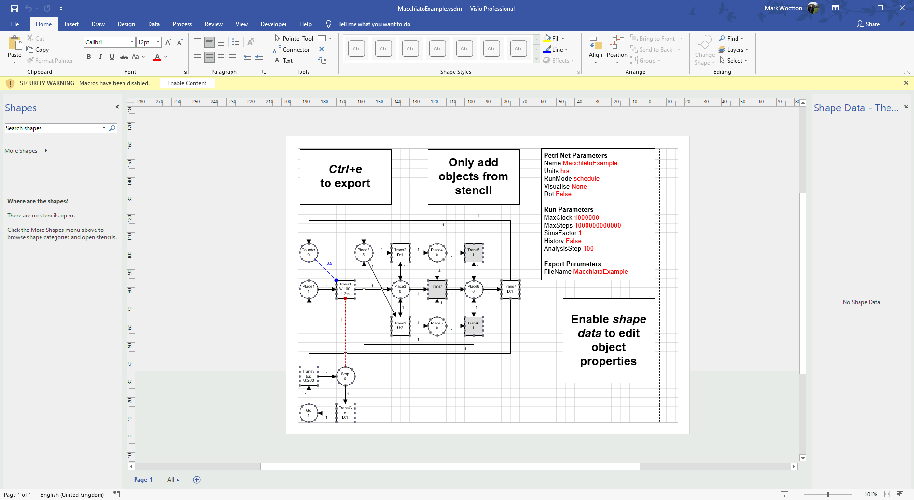
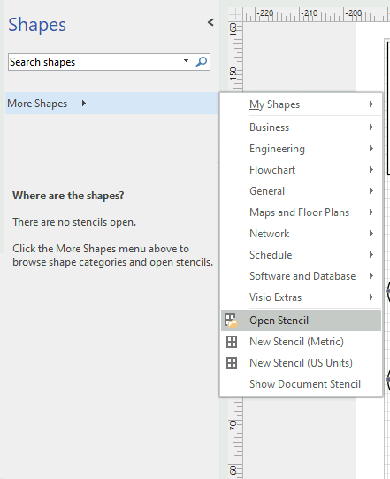
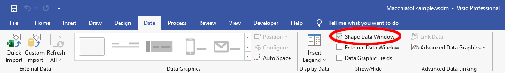
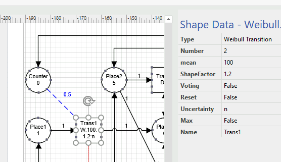
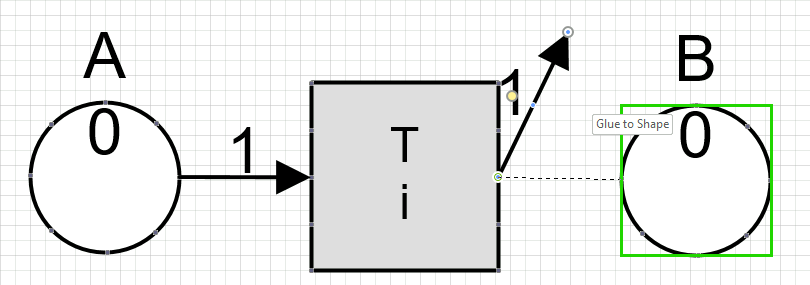
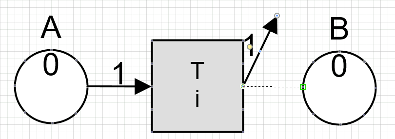
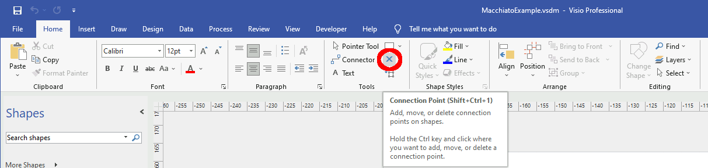
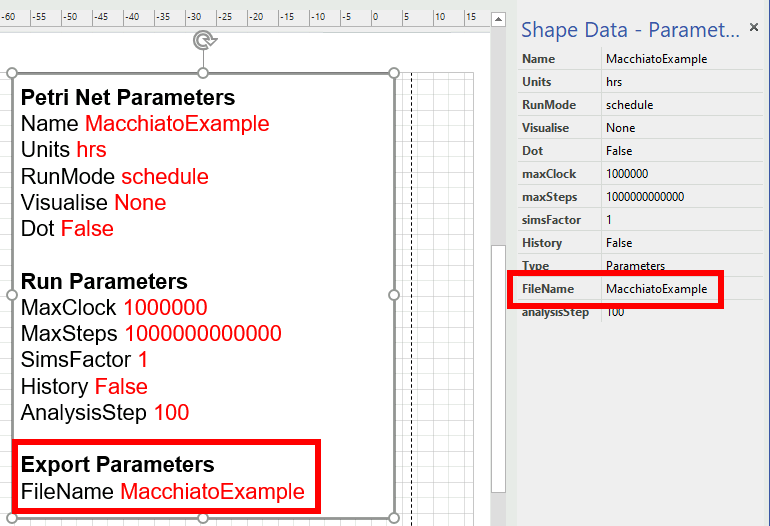

# Macchiato Petri Net Graphical Construction

*Graphic user interface for the construction of Petri Net input files for Macchiato*

## Dependencies

* [Macchiato](https://github.com/MJWootton-Research/Macchiato)
* [Microsoft Visio](https://www.microsoft.com/en/microsoft-365/visio/flowchart-software)

## Usage

To begin, make a copy of the the [example file](https://github.com/MJWootton-Research/Macchiato/blob/master/PetriNetDrawingTools/MacchiatoExample.vsdm), which contains the macro that exports the Petri Net as an `*.mpn` file.  A copy of the [stencil file](https://github.com/MJWootton-Research/Macchiato/blob/master/PetriNetDrawingTools/MacchiatoStencil.vssx) must be saved in the same directory or imported from the repository itself. Only objects from this stencil should be used.

When the example file is opened, a small banner will appear, asking the user  whether macros should be enabled. Click *"Enable Content"* as otherwise it will not be possible to export the Petri Net.

If the Macchiato stencil is not already visible in the *"Shapes"* panel, import `MacchiatoStencil.vssx` via *"More Shapes"* → *"Open Stencil"*.

  

Make sure that *"Shape Data Window"* is enabled in the *"Data"* tab.

  

The *"Shape Data"* panel is used to set the parameters for each object in the model, including the system parameters block.

  

New objects are added, either by dragging shapes from the stencil, or by copying existing ones. Particularly in the latter case, make sure that every place and transition has a unique name. The formatting of the objects can be changed freely. Likewise, the text of their labels can be edited as required or desired, but be aware that if the content pertaining to its properties is altered, the field in question will no longer auto-update with respect to later changes.

Connections must be made using the arc objects and not the default Visio connectors. The arcs are connected by dragging their end points onto the places and transitions, either linked to the centre or to an attachment point.

|  |  |
| :----------------------------------------------------------: | :----------------------------------------------------------: |

Additional points can be added from the *"Home"* tab. However, be certain that the correct object is selected as Visio will allow the user to attach a connection point associated with the currently selected object to any shape in the file, potentially causing failed or erroneous `*.mpn` export.

  

The model is exported to an `*.mpn` file when the key combination *"ctrl*+*e"* is pressed (If this shortcut fails, the macro can be activated manually via *"View"* > *"Macros"* > *"Run"*). The output is saved in the same directory as the source file with the name specified in the system parameters object. Existing files will be overwritten, with no warning issued, so be careful not to unintentionally destroy work.

  

## Acknowledgements

With thanks to Dr Robert *"Larus"* Lee for developing the original Macchiato stencil and macro for Microsoft Visio.
