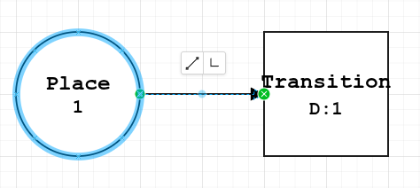
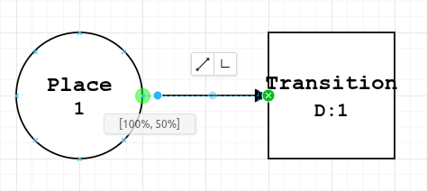
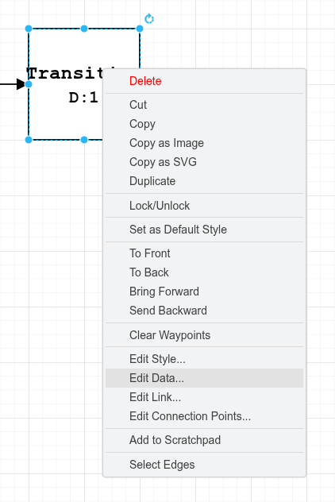
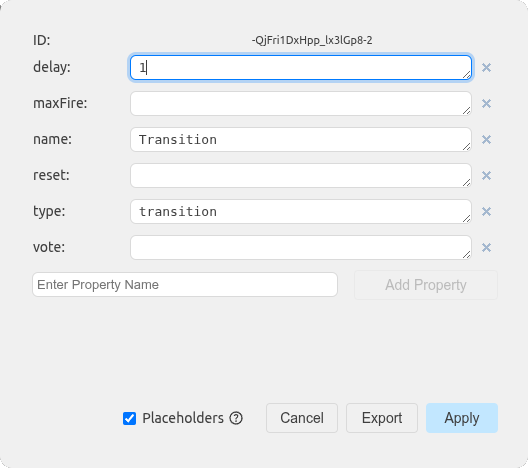
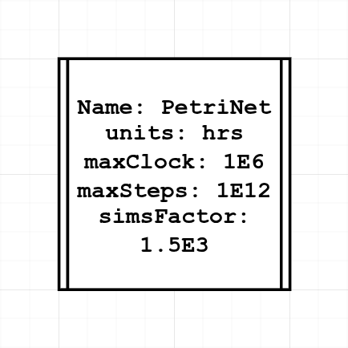

# Macchiato Petri Net Graphical Construction: draw.io

*Graphic user interface for the construction of Petri Net input files for Macchiato via draw.io*

## Dependencies

* [Macchiato](https://github.com/MJWootton-Research/Macchiato)
* [drawio.io](https://www.drawio.com/)

## Usage

Open the [template file](https://github.com/MJWootton-Research/Macchiato/tree/main/PetriNetDrawingTools/draw.io/Template.drawio). From here all of the supported Petri-net objects can be copied and pasted into a new file. Alternatively, import the [scratchpad](https://github.com/MJWootton-Research/Macchiato/tree/main/PetriNetDrawingTools/draw.io/MacchiatoScratchpad.xml) for ease of access without having to return to the template repeatedly. Connect arcs by dragging one end to a transition or place, either centrally (blue) or on a perimeter link point (green). Only use the arcs provided as generic arrow connectors will not be read correctly by Macchiato.

<p align="center"> </p>

Set object parameters by right clicking and selecting *"Edit Data..."* or by pressing *"ctrl*+*m"* when selected.

<p align="center"> </p>

In the pop-up menu, all the parameters for that object type can be set. Optional values can be left blank if unneeded. Be careful not to add line breaks or extra white space and remember to click *"Apply"* to save changes. Do not edit the *"type"* field.

<p align="center"> </p>

Make sure a properties object is added to set the name of the Petri net, units, and execution parameters.

<p align="center"> </p>

Macchiato can read `*.drawio` files directly, so there is no requirement to export a Petri net first. If the equivalent `*.mpn` file is desired, the conversion can be done using the `-x` option, e.g.

```shell
macchiato PetriNet.drawio -x
```
