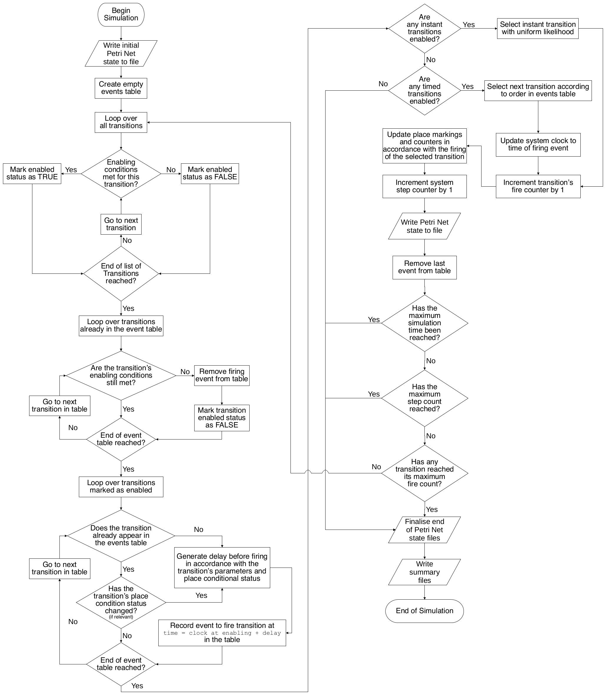

<p align="center">
  
</p>

[[makˈkjaːto](https://www.howtopronounce.com/italian/macchiato/8648604)], *from the Italian, meaning "spotted", "marked", or  "stained", in reference to a [latte macchiato](https://i.insider.com/568a8b92e6183e591e8b6575), which resembles a [Petri Net](https://en.wikipedia.org/wiki/Petri_net) place with a token.*

## A Simple Petri Nets Implementation for Python 3
### [Version 1-6-1](https://github.com/MJWootton-Research/Macchiato/blob/master/CHANGELOG.md)

© Dr. Mark James Wootton<br>
[`m.j.wootton@sheffield.ac.uk`](mailto:m.j.wootton@sheffield.ac.uk)

To cite this work,

- For standalone Petri net models, please reference:

> Mark James Wootton, John D. Andrews, Adam L. Lloyd, Roger Smith, A. John Arul, Gopika Vinod, M. Hari Prasad, Vipul Garg. Risk Modelling of Ageing Nuclear Reactor Systems, *Annals of Nuclear Energy*, volume 166, 108701, 2022. [`doi.org/10.1016/j.anucene.2021.108701`](https://doi.org/10.1016/j.anucene.2021.108701)

- For working involving the the [FMU interface](https://github.com/MJWootton-Research/Macchiato/tree/master/FMUInterface), please reference:

> Mark James Wootton, John D. Andrews, Ying Zhou, Roger Smith, A. John Arul, Gopika Vinod, M. Hari Prasad, and Vipul Garg. An Integrated Petri Net-Pseudo Bond Graph Model for Nuclear Hazard Assessment. *Safety and Reliability*, 1–48, 2024. [`doi.org/10.1080/09617353.2024.2363067`](https://doi.org/10.1080/09617353.2024.2363067)

## Contents

* [Dependencies](#dependencies)
* [Installation](#installation)
    * [Download](#download)
    * [System Integration](#system-integration)
        * [Bash & Z Shell](#bash--z-shell)
        * [PowerShell](#powershell)
    * [Graphviz](#graphviz)
        * [Linux](#linux)
        * [Windows](#windows)
        * [MacOS](#macos)
* [Usage](#usage)
    * [Macchiato Petri Net Files (`*.mpn`)](#macchiato-petri-net-files-mpn)
        * [Structure](#structure)
        * [Simulation Parameters](#simulation-parameters)
        * [Places](#places)
        * [Transitions](#transitions)
        * [Arc Properties](#arc-properties)
        * [Additional Transition Features](#additional-transition-features)
        * [Example](#example)
    * [Graphical Petri Net Construction with Microsoft Visio](#graphical-petri-net-construction-with-microsoft-visio)
    * [Scripting Tools](#scripting-tools)
        * [Reading & Writing `*.mpn` Files](#reading--writing-mpn-files)
        * [Manipulating Petri Nets](#manipulating-petri-nets)
    * [Analysis](#analysis)
    * [Visualisation](#visualisation)
    * [FMU Interface](#fmu-interface)
* [Acknowledgements](#acknowledgements)
* [References](#references)

## Dependencies
* [Python 3](https://www.python.org)
  * [NumPy](https://numpy.org/) — only required by [analysis scripts](https://github.com/MJWootton-Research/Macchiato/tree/master/Analysis)
  * [Matplotlib](https://matplotlib.org/) — only required by [analysis scripts](https://github.com/MJWootton-Research/Macchiato/tree/master/Analysis)
* [Graphiz](http://graphviz.org) — only required by [visualisation features](https://github.com/MJWootton-Research/Macchiato#graphviz)
* [Microsoft Visio](https://www.microsoft.com/en/microsoft-365/visio/flowchart-software) — only required for [graphical Petri Net construction tool](https://github.com/MJWootton-Research/Macchiato/tree/master/PetriNetDrawingTools)

## Installation
### Download

Cloning the repository via [Git](https://git-scm.com) is the recommended method for installing Macchiato. To see whether you have Git installed and the current version, open a command-line terminal and run:

```shell
git --version
```
If no Git installation is found, consult [this page](https://git-scm.com/book/en/v2/Getting-Started-Installing-Git) for further instructions. It is recommended to [create an SSH key](https://docs.github.com/en/github/authenticating-to-github/generating-a-new-ssh-key-and-adding-it-to-the-ssh-agent) and [add it to one’s GitHub account](https://docs.github.com/en/github/authenticating-to-github/adding-a-new-ssh-key-to-your-github-account) to eliminate the need for password entry during pull requests.

Create a folder named `git` in your home directory and enter it in the terminal. The following command will create a local instance of the repository in the current working directory:
```shell
git clone git@github.com:MJWootton-Research/Macchiato.git
```

or if SSH key authentication has not been set up, the repository can instead be accessed via username and password through the command:

````shell
git clone https://github.com/MJWootton-Research/Macchiato.git
````

To update the repository, execute the following command in its directory:

```shell
git pull
```

In the following sections, it is assumed that Python 3 is invoked by `python`. Depending on system step up, one may need to substitute this command with `python3`. The default version of Python can be found via:

```shell
python --version
```

If not already present, Python 3 should be installed via your operating system's package manager or obtained from www.python.org

### System Integration

One can configure their system to allow Macchiato to be accessed conveniently from any working directory within a terminal or Python session, such that simulations can be initiated with command `Macchiato` from any location, and that a Python script using the module need only include the line `import Macchiato`, regardless of the file path.

#### Bash & Z Shell

In a Bash or Z Shell environment, such as is default in many Linux distributions and of MacOS, add the following two lines to the file found in the Home directory with the name `.bashrc` or `.zshrc` respectively.

```bash
# Execute Macchiato simulations from any directory
Macchiato(){ python3 $HOME/git/Macchiato/Macchiato.py $* ; }
# Make Macchiato availible for Python to import from any directory
export PYTHONPATH=$HOME/git/Macchiato:$PYTHONPATH
```

The changes will take effect immediately in any new terminal instance. In an existing terminal, you can update via the command `source ~/.bashrc` or `source ~/.zshrc` as appropriate.

You may need to change the path `$HOME/git/Macchiato` if Macchiato was installed at a different location. Likewise, you may need to substitute `python3` for `python` on the first line.

#### PowerShell

For users of PowerShell on Windows 10, the integration must be done in two steps. To allow easy execution of Macchiato simulations from any directory, create a folder in `Documents` called `WindowsPowerShell`. In this new folder, add a plain text file with the name `Microsoft.PowerShell_profile.ps1` containing the lines:

```powershell
# Execute Macchiato simulations from any directory
function Macchiato {
    python $home\git\Macchiato\Macchiato.py $args
}
```

To make Macchiato available for import to any Python instance or script, open *"Settings"* from the *Start Menu* and search for *"advanced system settings"*. You will see a result for *"View advanced system settings"*. Clicking on this option will open a window title *"System Properties"*. On the *"Advanced"* tab, there is a button labelled *"Environmental Variables"*, which brings up a window with the same name. In the beneath the *"System variables"* selection, click on *"New..."*. In the field *"Variable name"* enter `PYTHONPATH` and in *"Variable value"* enter:

```
C:\Users\{YOUR_USERSNAME}\git\Macchiato
```

Click *"OK"* on the three open windows to save your changes, which will take effect for any new PowerShell instance. If a variable called `PYTHONPATH` already exists, click *"Edit..."* instead, and append the directory of the Macchiato project folder to the of the *"Variable value"*, separating it from the preexisting content with `;`.

You may need to change the above paths if Macchiato was installed at a different location. Likewise, you may need to substitute `python3` for `python` in the profile file.

### Graphviz

The recommended method for installing Graphviz is via a package manager, such that the rendering of `*.dot` files as images be made available at the command line via `dot {etc}`.

#### Linux

Graphviz is available through the package managers of most Linux distributions

**`apt` (Debian, Ubuntu, Linux Mint, Pop!_OS, elementary OS, etc.):**

```bash
sudo apt install graphviz
```

**`yum` (Fedora, CentOS, RHEL, Scientific Linux, Yellow Dog Linux, Oracle Linux, etc.)**

```bash
sudo yum install graphviz
```

**`pacman`  (Arch, Manjaro, etc.)**

```bash
sudo pacman -Syy graphviz
```

#### Windows

Windows users will need to install an appropriate command line installer first, for example [Scoop](https://scoop.sh), from which Graphviz is installed by:

````powershell
scoop install graphviz
````

It may also be necessary to run the command `dot -c` with administrative privileges to complete the process.

It is also possible to download an installer from Graphviz's website. This continues to be available as a legacy option, in which case the directory containing the executable `dot.exe` must be manually specified as the value of the `docLoc` parameters. This method is not recommended.

#### MacOS

On MacOs install Graphviz via [Homebrew](https://brew.sh/), via:

```shell
brew install graphviz
```

## Petri Net Integration Algorithm

The below flowchart depicts the process followed by Macchiato to execute an individual Petri Net simulation. Image from [Wootton *et al.* 2022](https://doi.org/10.1002/asmb.2722), ([CC BY 4.0](https://creativecommons.org/licenses/by/4.0))

<p align="center">
  
</p>

## Usage

Macchiato Petri Net structures are stored in `*.mpn` files, the creation of which is discussed [below](#macchiato-petri-net-files-mpn).

Assuming the instructions for [system integration](#system-integration) have been followed, the following command will run a batch of simulations, where `{nSims}` should be replaced with the desired number of iterations:

```shell
Macchiato /path/to/PetriNet.mpn {nSims}
```

Note that regardless of the locations of Macchiato or the Petri Net file, the simulation output will be delivered within the current working directory. If `{nSims}` is omitted from the above command, the simulations will continue until the total time simulated across all iterations reaches the product of `maxClock` and `simsFactor`, see [*Simulation Parameters*](#simulation-parameters). Additional terminal output can be activated by placing `-v` or `--verbose` at the end of the above command, but be aware that this will negatively impact performance.

If it is necessary to restrict the output in the relevant `*.cvs` files produced to a limited selection of places or transitions, this can be done by adding the command line flags `-p` and `-t`, for example:

```shell
Macchiato /path/to/PetriNet.mpn -p P0 P1 P2 -t T0 T1 T2
```

The help text is displayed by:

```bash
Macchiato --help
```

### Macchiato Petri Net Files (`*.mpn`)

A Petri Net description in `*.mpn` format may be created textually, as outlined in the following subsections, or via the tools seen in *[Graphical Petri Net Construction with Microsoft Visio](#graphical-petri-net-construction-with-microsoft-visio)*. One may also create and manipulate Petri Net structures in a Python script using the tools provided in the module `PetriNet.py` as documented in [*Scripting Tools*](#scripting-tools).

It is assumed that the reader is already familiar with the basics of standard Petri Net modelling<sup>[[1]](#r1)</sup>.

#### Structure

An `*.mpn` should be comprised of three sections — the simulation parameters, the places list, and the transitions list. To mark the beginning of of the latter two, the lines `Places` and `Transitions` must respectively appear in the file. Any input on a line after a `#` character is treated as a comment. An example file is seen in [`Example.mpn`](https://github.com/MJWootton-Research/Macchiato/blob/master/Example.mpn).

#### Simulation Parameters

If a parameter is not specified in the `*.mpn` file, it takes its default value. To set a parameter, add a line with its name, followed directly by a single space and the desired value.

- `name` — The label given to the Petri Net and used in output directories
- `units` — The units of time to be used by the Petri Net (Default is `hrs`)
- `runMode` — The mode of integration to be used for simulation (Default is `schedule`). Don't play with this setting unless you know what you are doing.
- `dot` — Toggle creation of snapshots of the Petri Net during simulation in `*.dot` format (Default is `False`).
- `visualise` — The file format for images produced from snapshots. Supported formats include, but are not limited to, `svg` (recommended),  `pdf`, and `png` (Default is `None`, which produces no images. Note that `dot` must also be set to `True`, otherwise `visualise` will have no effect).
- `details` — Toggles label with Petri Net name, step, and clock in visualisations (Default is `True`)
- `useGroup` — Toggles use of place and transition groups in visualisation (Default is `True`)
- `orientation` — Orientation of Petri Net in visualisations.  Options are `LR`, `RL`, `TB`, and `BT` (Default is `None` — produces default behaviour of Graphviz algorithm).
- `debug` — Default is `False`.
- `maxClock` — Greatest clock duration permitted in any one simulation (Default is 10<sup>6</sup> `units` of time)
- `maxSteps` — Greatest number of steps permitted in any one simulation (Default is 10<sup>12</sup>)
- `simsFactor` — Parameterises the total number of simulations performed (Default is 1.5×10<sup>3</sup>).  Repetition of simulations ends once the total simulated time surpasses the product of `maxClock` and `simsFactor`.  If a set number of simulations is specified at the command line, `simsFactor` is overruled.
- `dotLoc` — (Default is `None`) Directory containing `dot.exe` for legacy mode visualisations (not recommended).

**Important Note:** It is not recommended to use the `visualise` option beyond testing and development of Petri Nets and performance is significantly affected. Instead, consider using the tools provided by [`mpn_to_dot.py`](https://github.com/MJWootton-Research/Macchiato/blob/master/mpn_to_dot.py) and [`dot_to_image.py`](https://github.com/MJWootton-Research/Macchiato/blob/master/dot_to_image.py) after the simulations are complete. If one is not intending to use `dot_to_image.py`, then it is also recommended to set `dot` to `False`.

#### Places

The places section of the file begins following the line `Places`.  To add a place, simple add a new line with the desired name (spaces are not permitted). By default, a place's initial token count is zero, but a value may be specified after a space on the same line, e.g. `P1 2` will add a place of name *P1* with two tokens at the start of each simulation.

#### Transitions

The transitions section of the file begins following the line `Transitions`. A transition and its properties are specified with a line with the following format (do not include brackets):

```
{Name}:{Timing}:{Parameters} IN {places} OUT {places} VOTE {threshold} RESET {places}
```

`Timing` specifies the duration from the enabling of a transition to its firing, which may be instantaneous, of a fixed length, or generated from a stochastic distribution. Most options require one or multiple parameters, subsequently delimited by `:` and expressed in terms of the parameter `units` where relevant. The following timing options are available:

- `instant` — A instant transition will fire on the next simulation step with zero advancement of the system clock. If multiple instant transitions are simultaneously enabled, one will be chosen at random with uniform weight.
- `delay:a` — A transition with a fixed delay fired after a set duration `a` once enabled.

- `uniform:u` — A transition with a uniform distribution will fire at some time, $t$, in the interval $0 < t <$ `u`.

- `cyclic:c:ω` — A cyclic transition fires at the next instance at with the simulation clock is a non-zero integer multiple of `c`. The second parameter `ω` allows one to apply an offset. For instance, if two transitions with the parameters `cyclic:1:0` and `cyclic:1:0.5` are persistently enabled, they will respectively fire at the system times, 1, 2, 3 `units` etc, and 1.5, 2.5, 3.5 `units` etc.
- `weibull:<t>:β:σ` — A transition with this option will be characterised by a Weibull distribution<sup>[[2]](#r2)</sup> with mean `<t>` and shape parameter `β`. Its firing time, $t$, is given by $t = \eta [\ln(X)]^{-\beta}$, where $\eta$ is the scale parameter, such that $\eta = < t > [\Gamma(\beta^{-1} + 1)]^{-1}$, and $X$ is a random variable uniformly distributed in the range $0 < X < 1$, with $\Gamma$  being the Gamma Function<sup>[[3]](#r3)</sup>. The parameter `σ` is optional and is used when the mean time has an associated uncertainty, such that the scale parameter used for each firing delay calculated is produced from a normal distribution<sup>[[4]](#r4)</sup> with mean equal to the default $\eta$ and a standard deviation of `σ`.

- `lognorm:μ:σ` — A transition with log-normal distribution<sup>[[5]](#54)</sup> timing fires after time, $t$, where $t = \exp(\mu + \sigma X)$, with *X* being a standard normal variable, and `μ` and `σ` respectively being the mean and standard deviation of the natural logarithm of the firing delay.
- `rate:r` — A transition of this type fires with a constant rate parameterised by `r`. Firing time, $t$, is exponentially distributed <sup>[[6]](#r6)</sup>, such that $t = -r^{-1}\ln(X)$, where *X* is a random uniform variable in the range $0 < X < 1$.

- `beta:p:q:k` — A transition with the Beta Distribution<sup>[[7]](#r7)</sup> produces a firing delay, $t$, in the interval $0 < t < 1$, parameterised by `p` and `q`, which weight the probability density towards the extreme or central regions of the available outcome space. An optional parameter `k` can be added to scale the distribution, such that the range of possible values becomes $0 < t <$ `k`.

Note that a transition must be continuously enabled for the duration from firing time generation until it fires. If its enabled status is interrupted, its scheduled firing time will be discarded.

#### Arc Properties
Any places listed after `IN` and `OUT` will be connected to the transition by incoming and outgoing arcs respectively and places listed should be separated by a single space. The weight of an arc is 1 by default and can be given some other value by appending it, separated by `:`, to the name of the relevant place in the list. for example, `IN P1 P2:3 P3 OUT P4 P5:2` specifies three incoming arcs, the second of which has a weight of 3, and two outgoing arcs, the latter of which has a weight of 2.

An incoming arc may be designated as a place conditional or inhibit arc with the code `:pnc` or `:inh` respectively, placed after the arc weight. The action of an inhibit arc is simple to disable its target transition when its weight is met, regardless of the status of the other arcs. A place conditional arc does not enable or disable its target transition but instead modifies its firing time parameters. The modification factor for a transition with $C$ place conditional arcs is a function of the arc weights (which can be non-integer for place conditionals) and the number of tokens on the connected places, such that, $P = 1 + \Sigma_{i}^{c} W_{i} N_{i}$. The alterations to parameters are then, $a \rightarrow \frac{a}{P}$, $u \rightarrow \frac{u}{P}$, $c \rightarrow \frac{c}{P}$, $a \rightarrow \frac{a}{P}$, $< t > \rightarrow \frac{< t >}{P}$, $\mu \rightarrow \frac{\mu}{P}$, $\rightarrow \frac{k}{P}$, and $r \rightarrow r P$.

#### Additional Transition Features
Transitions may also be given the properties `VOTE` and `RESET`. A voting transition does not require all of its incoming arc weights to be met to become enabled. Instead, only a given threshold need be met, placed after `VOTE`, separated by a single space. For example, a transition, `T1` with the place relationship given by `T1:instant IN P1 P2 P3 OUT P4 VOTE 2` would only require two of `P1`, `P2`, and `P3` to hold a token in order to fire. Note that *all* incoming arcs whose weight is satisfied are treated normally for the purposes of removing tokens when the transition fires. A reset transition has an associated list of places, delimited by `:` and following `RESET`, separated by a single space, e.g. `RESET P1:P2:P3`. When the transition fires, the places marked for reset are restored to the token count held at the beginning of the simulation.

#### Example

```
# Petri Net Parameters
	name Test
	units hrs
	runMode schedule
	visualise None
	dot False

# Run Parameters
	maxClock 1E3
	maxSteps 100
	simsFactor 1

# Build Petri Net
Places
	P0 2
	P1
	P2
	P3

Transitions
	T0:lognorm:1:1 IN P0 OUT P1 P3
	T1:weibull:1:0.5 IN P1 OUT P2:2
	T2:delay:2 IN P2:2 P3:inh OUT P1
	T3:rate:15 IN P3:5:pcn P1 OUT P2
	R:cyclic:7:1 IN P2 RESET P0:P1:P3
	V:beta:1:2:0.25 IN P0 P1 P3 OUT P2 VOTE 2
```

#### Graphical Petri Net Construction with Microsoft Visio

As an alternative to transcribing a Petri Net structure by hand, it is possible to graphically construct a model in Microsoft Visio and export as an `*.mpn`. This is general considerably simpler and more expedient, and has the secondary benefit of concurrently producing high quality figures for reports and publications.

In the directory [`PetriNetDrawingTools`](PetriNetDrawingTools), one will find a Microsoft Visio drawing and a stencil file. Create a copy of these files to produce Petri Nets graphically — both must be found in the same directory. To use the tool, make sure that stencils and shape data are set to be visible and that macros are enabled. The shortcut *Ctrl+e* will export the Petri Net to an `*.mpn` file with the properties specified in the *Parameters* object. It is recommended to export models frequently to avoid being caught out by the occasional idiosyncrasies of Microsoft Visio.

[Full documentation for the tool is available here](https://github.com/MJWootton-Research/Macchiato/blob/master/PetriNetDrawingTools/README.md).

### Scripting Tools

The Python modules provided by [`Macchiato.py`](Macchiato.py) and [`PetriNet.py`](PetriNet.py) can be imported into a script to provide a range of tools suitable for more complex creation and manipulation of Petri Net models, as well as basic functions such as reading and writing from `*.mpn` files. For example, if one wished to create a range of similar systems with varying parameters or varying number of duplicated sections, the scripting tools would enable the automation of this process. The documentation for the features is found within the module files themselves, with descriptions provided for each object type, method, and function. A few examples are found below.

#### Reading & Writing `*.mpn` Files

Importing  [`Macchiato.py`](Macchiato.py)  gives access to the `read` and `write` functions, which allow the handling of `*.mpn` files. The function `read` takes a file path and returns a `PetriNet` object (as defined in [`PetriNet.py`](PetriNet.py)) and `list` object containing the simulation parameters in the file.

```python
# Import module
import Macchiato as MC

# Read *.mpn file
pn, simParams = MC.read('/path/to/PetriNet.mpn')
```

Conversely, `write` takes a `PetriNet` object and writes it to an `*.mpn` file

```python
# Import module
import Macchiato as MC

# Creat a Petri Net
pn = fooPetriNet
# Write Petri Net to *.mpn file
MC.write(pn, overwrite=False, rp=None, altName=None)
```

Note the parameters `overwrite`, `rp`, and `altName` are optional, and respectively control whether existing files can be overwritten (default value is `False`), a `list` object containing the simulation parameters written to the file (default value is `None`, resulting in the default parameters being used, see [Simulation Parameters](#simulation-parameters)), and the name given to the Petri Net in the file produced (default value is `None`, which results in no change in name).

#### Manipulating Petri Nets

To create a `PetriNet` object from scratch, import the module [`Macchiato.py`](Macchiato.py) and initialise an instance of the class, with any parameter not provided by the user defaulting to the value shown in the following example (a value should ideally always be given for `name`).

```python
# Import module
import Macchiato as MC

# Create instance of PetriNet object (with default values shown - these may be ommitted)
pn = MC.PetriNet(name=None, units='hrs', runMode='schedule', dot=False,
                 visualise=None, details=True, useGroup=True, orientation=None,
                 debug=False, dotLoc=None)
```

The structure of a `PetriNet` object created by either of methods discussed may be constructed or edited by the methods, `addPlace`, `rmvPlace`, `addTrans`, and `rmvTrans`. The `PetriNet` object has the attributes `places` and `trans` (both of type `list`) which store objects of the class `Place` and `Trans` respectively. The `Trans` object has the methods `addInArc`, `rmInARc`, `addOutArc`, and `rmOutARc`, to link and unlink it from `Place` objects via `Arc` objects. In the following example, a simple loop is created from two places and two transitions.

```python
# Import module
import Macchiato as MC

# Create instance of PetriNet object
pn = PN.PetriNet(name='Example')
# Add places
pn.addPlace('P1', tokens=2)
pn.addPlace('P2')
# Add transition T1 and its arcs
pn.addTrans('T1', weibull=[100000, 1.2])
pn.trans['T1'].addInArc('P1')
pn.trans['T1'].addOutArc('P2')
# Add transition T2 and its arcs
pn.addTrans('T2', delay=48)
pn.trans['T2'].addInArc('P2', weight=2)
pn.trans['T2'].addOutArc('P1', weight=2)
```

The optional parameters for `addPlace` are:

* `tokens` — Type: `integer`. The initial number of tokens held (Default is 0)
* `min` — Type: `integer`. Minimum limit for tokens held by the place (Default is `None`, i.e. no lower limit)
* `max` — Type: `integer`. Maximum limit for tokens held by the place (Default is `None`, i.e. no upper limit)
* `limits` — Type: `list` of length two, containing `integer` types. If the number of tokens held by the place is found to be less than the first entry or greater than the second, a simulation of the Petri Net is terminated.
* group — Type: `integer`. Grouping label for Graphviz

The optional parameters for `addTrans` are:

* A timing parameter, pick one of the following or omit it to produce an instant transition:
  * `rate` — Type: `float`. Mean rate of fire per unit time
  * `uniform` — Type: `float`. Uniformly distribution in 0 to `uniform`
  * `delay` — Type: `float`. Value of fixed delay
  * `weibull` — Type: `list` of `float` types. Two or three of parameters for a Weibull distribution (`<t>` and `β`, and optional uncertainty parameter `σ`).
  * `beta` — Type: `list` of `float` types. Two parameters for Beta distribution (`p` and `q`) and optional scale parameter (`k`).
  * `lognorm` — Type: `list` of `float` types. Two parameters for log-normal distribution (`μ` and `σ`).
  * `cyclic` — Type: `list` of `float` types. Two parameters for cyclic distribution (`c` and `ω`).
* `maxFire` — Type: `integer`: Maximum number of times the transition can fire before the simulation terminates
* `reset` — Type: `list` of `string` types: The labels of places which are reset when the transition fires.
* `vote` — Type: `integer`. Voting threshold for the transition (Default is `None`, which results in no voting behaviour)
* `group` — Type: `integer`. Grouping label for Graphviz

The optional parameters for `addInArc` are:

* `weight` — Type: `integer`. The weight of the arc
* `type` — Type: `string`. The type of the arc. The available options are:
  * `'std'` — a normal arc and the default value
  * `'inh'` — an inhibit arc
  * `'pcn'` — a place conditional arc

There is one optional parameter for `addOutArc`:

* `weight` — Type: `integer`. The weight of the arc.

The methods `rmvPlace`, `rmvTrans`, `rmInArc`, and `rmOutArc` all remove objects of the corresponding type from the parent object (a `PetriNet` for `Place` and `Trans`, a `Trans` for `Arc`). They all only take only one argument, i.e. a `string` containing the relevant object label, which is the label of the object itself for `Place` and `Trans`, but is the label of the connecting `Place` object for `Arc` objects. Removing a place or transition from the Petri Net also removes all of its  associated arcs.

The `PetriNet` object has the method `run` which will simulate the Petri Net specified up to a given maximum number of steps (`integer`), and optionally, a maximum simulated time (`float`). In the example below, a `PetriNet` object, `pn`, is to be run for maximum of 100 steps or a maximum simulated time of 5×10<sup>5</sup> units.

```python
pn.run(100, maxClock=500000)
```

This makes it possible to run any arbitrary code between steps for highly customisable simulation scripts. For example:

```python
# Import modules
import Macciato as MC

# Create instance of PetriNet object
pn = MC.PetriNet(name='Example')
# Add places
pn.addPlace('P1', tokens=2)
pn.addPlace('P2')
# Add transition T1 and its arcs
pn.addTrans('T1', weibull=[100000, 1.2])
pn.trans['T1'].addInArc('P1')
pn.trans['T1'].addOutArc('P2')
# Add transition T2 and its arcs
pn.addTrans('T2', delay=48)
pn.trans['T2'].addInArc('P2', weight=2)
pn.trans['T2'].addOutArc('P1', weight=2)

# Write initial structure to *.mpn file
MC.write(pn, altName='%s_start'%pn.name)

# Write initial Petri Net marking to file
pfile, tfile, tlist = pn.writeNetStart(pn.runMode)

# Begin simulation process
while True:
    pn.run(1, verbose=False, fileOutput=False)
    pn.writeNet(pfile, tfile, tlist, pn.runMode)
    if fooCondition:
        # Modify the Petri Net or run some other code
        # ...
        fooProcess(pn)
        # ...
        if MarkingAltered: # Record changes to the marking of the Petri Net
            pn.step += 1
            pn.clock = newTime # if relevant
            pn.writeNet(pfile, tfile, tlist,
        	            pn.runMode)
    else:
        # Conditions for terminating simulation
        # ...
        break

# Finalise output files
pn.placesSummary(pn.runMode, tOut=True, pfile=pfile)
pfile.close()
tfile.close()
tlist.close()

# Write final structure to *.mpn file
MC.write(pn, altName='%s_end'%pn.name)
```

### Analysis

Four Python scripts are available in the [`Analysis`](Analysis) directory to aid in the extraction of results from Petri Net simulations. As the data produced by Macchiato is saved in `*.csv` format, it is fairly simple to produce new analysis tools and users are encouraged to do so.

Documentation for the usage of the analysis scripts is found [here](https://github.com/MJWootton-Research/Macchiato/blob/master/Analysis/README.md).

### Visualisation

In the [`Visualisation`](https://github.com/MJWootton-Research/Macchiato/blob/master/Visualisation) directory, two scripts are available to produce images of Petri Nets from `*.mpn` files or Macchiato simulation output. These depend on Graphviz and are best suited for inspection and verification rather instead of creating report quality images, for which the [Visio tools](https://github.com/MJWootton-Research/Macchiato/blob/master/PetriNetDrawingTools/README.md) are recommended.

Documentation for the usage of the visualisation scripts is found [here](https://github.com/MJWootton-Research/Macchiato/blob/master/Visualisation/README.md).

### FMU Interface

Macchiato Petri Nets can also be used in conjunction with a physical model provided in [FMU format](https://en.wikipedia.org/wiki/Functional_Mock-up_Interface), the tools for which are provided in the [`FMUInterface`](https://github.com/MJWootton-Research/Macchiato/tree/master/FMUInterface) directory.

## Acknowledgements
With thanks to Dr Robert *"Larus"* Lee for developing the original Macchiato stencil and macro for Microsoft Visio.

## References

<b id="r1">[1]</b> Carl Adam Petri. *Kommunikation  mit  Automaten* (In  German). PhD thesis, Technical University Darmstadt, 1962.

<b id="r2">[2]</b> Athanasios Papoulis and S. Unnikrishna Pillai. Probability, *Random Variables and Stochastic Processes*.  McGraw Hill, 4<sup>th</sup> edition, 2002

<b id="r3">[3]</b> Eric W. Weisstein. *"Gamma Function." From* MathWorld--​*A Wolfram Web Resource*. www.mathworld.wolfram.com/GammaFunction.html *Accessed October 2020*, Last edited: 2005.

<b id="r4">[4]</b> Eric W. Weisstein. *"Normal  Distribution." From* MathWorld--​*A Wolfram Web Resource*. www.mathworld.wolfram.com/NormalDistribution.html *Accessed October 2019*, Last edited: 2019.

<b id="r5">[5]</b> Brian Dennis and G. P. Patil. *Lognormal Distributions, Theory and Applications*. Marcel Dekker New York, 1987.

<b id="r6">[6]</b> Eric W. Weisstein. *"Exponential Distribution." From* MathWorld--​*A Wolfram Web Resource.* https://mathworld.wolfram.com/ExponentialDistribution.html *Accessed October 2019*, Last edited: 2006.

<b id="r7">[7]</b> Eric W. Weisstein. *"Beta Distribution." From* MathWorld--*A Wolfram Web Resource.* https://mathworld.wolfram.com/BetaDistribution.html *Accessed March 2021*, Last edited: 2003.
